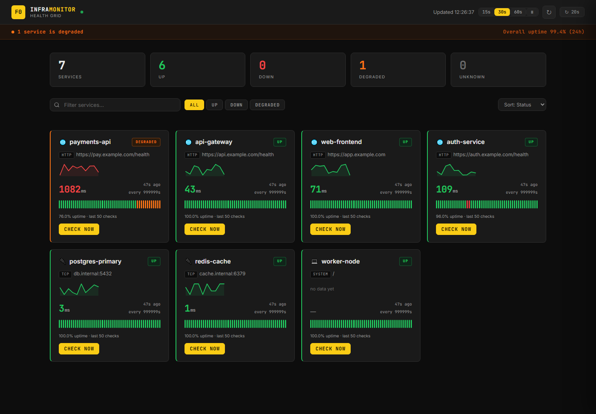

# infra-health-monitor

[](https://github.com/Mr-F0ol/infra-health-monitor/actions/workflows/ci.yml)
[](https://codecov.io/gh/Mr-F0ol/infra-health-monitor)
[](LICENSE)

A lightweight infrastructure health monitor that checks HTTP endpoints, TCP ports, and local system resources automatically — with scheduled monitoring, state-transition alerting, and Prometheus metrics.



## Architecture

```
┌─────────────────────────────────────────────────────────┐
│                  FastAPI  :8000                          │
│                                                         │
│  GET /health    GET /services    GET /history           │
│  GET /metrics   POST /checks/run                        │
│                                                         │
│  ┌─────────────────────────────────────────────────┐   │
│  │  APScheduler — one job per service              │   │
│  │  run check → persist → metrics → alert          │   │
│  └─────────────────────────────────────────────────┘   │
└──────────┬───────────────┬───────────────┬─────────────┘
           │               │               │
      ┌────▼───┐     ┌─────▼────┐   ┌──────▼──────┐
      │Postgres│     │  Redis   │   │  /metrics   │
      │ results│     │  state   │   │  endpoint   │
      └────────┘     └──────────┘   └──────┬──────┘
                                           │  scrape
                                    ┌──────▼──────┐
                                    │ Prometheus  │
                                    └──────┬──────┘
                                           │
                                    ┌──────▼──────┐
                                    │   Grafana   │
                                    │   :3000     │
                                    └─────────────┘
```

## Stack

- **FastAPI** — HTTP API and metrics endpoint
- **APScheduler 3.x** — in-process job scheduler (one job per service)
- **SQLAlchemy 2.0** — persistence (SQLite by default, Postgres via Docker)
- **Redis** — last-known state per service for alert deduplication
- **prometheus-client** — Prometheus metrics exposition
- **httpx / psutil** — HTTP probing and system metrics

## Project layout

```
src/monitor/
├── config.py            # settings (pydantic-settings + .env)
├── models.py            # SQLAlchemy ORM
├── database.py          # engine / session
├── service_config.py    # services.yaml parsing
├── scheduler.py         # APScheduler setup
├── metrics.py           # Prometheus gauges / histograms / counters
├── alerts/
│   ├── base.py          # AlertProvider protocol
│   ├── discord.py       # Discord webhook
│   ├── telegram.py      # Telegram bot
│   └── notifier.py      # state-transition + Redis dedup
└── checks/
    ├── base.py          # BaseCheck + CheckState enum
    ├── http_check.py
    ├── tcp_check.py
    └── system_check.py
monitoring/
├── prometheus.yml
└── grafana/
    ├── provisioning/    # auto-wired datasource + dashboard
    └── dashboards/      # infra-monitor.json
```

## Quick start

```bash
cp .env.example .env
docker compose up -d
```

| Service | URL |
|---------|-----|
| API | http://localhost:8000 |
| API docs | http://localhost:8000/docs |
| Grafana | http://localhost:3000  (admin / admin) |
| Prometheus | http://localhost:9090 |
| Alertmanager | http://localhost:9093 |

## Configure services

Edit `services.yaml` before starting:

```yaml
services:
  - name: my-api
    type: http
    target: https://api.example.com/health
    interval: 60          # seconds between checks

  - name: my-db
    type: tcp
    target: db.example.com
    port: 5432
    interval: 30

  - name: local-system
    type: system
    target: /             # filesystem path for disk check
    interval: 120
    thresholds:
      cpu: 85.0
      memory: 85.0
      disk: 90.0
```

## API reference

| Method | Endpoint | Description |
|--------|----------|-------------|
| GET | `/health` | Liveness — process is up (cheap, no dependencies) |
| GET | `/ready` | Readiness — verifies DB (and Redis if alerting on); `503` if not |
| GET | `/services` | Current status of every configured service |
| GET | `/history?service=name` | Check history for one service |
| GET | `/metrics` | Prometheus exposition format |
| GET | `/uptime?window=24h\|7d\|30d` | Availability % per service over a rolling window |
| POST | `/reload` | Re-read `services.yaml` and reconcile scheduler jobs live |
| POST | `/checks/run` | Run a one-off check immediately |
| GET | `/checks/results` | Recent check results |

### Reloading config without a restart

Edit `services.yaml`, then:

```bash
curl -X POST -H "X-API-Key: $MONITOR_API_KEY" http://localhost:8000/reload
# {"services": 4, "added": ["new-svc"], "removed": ["old-svc"], "updated": ["api"]}
```

`/reload` diffs the file against the running scheduler — new services get a job,
removed ones are unscheduled, and changed ones (interval, target, thresholds)
are replaced. Unchanged services keep running undisturbed. An invalid file
returns `400` and leaves the live jobs untouched.

## Authentication

Auth is **opt-in**. With no credentials set the API is open (the zero-friction
quick-start). Set either or both schemes in `.env` to lock it down:

```env
MONITOR_API_KEY=long-random-string          # automation: header X-API-Key
MONITOR_BASIC_AUTH_USER=admin                # browser dashboard
MONITOR_BASIC_AUTH_PASSWORD=change-me
```

When enabled, protected endpoints (`/`, `/services`, `/history`, `/reload`,
`/uptime`, `/checks/*`) require **either** a matching `X-API-Key` header **or**
HTTP Basic credentials. `/health`, `/ready` and `/metrics` stay open so
orchestrators and Prometheus can reach them. Use Basic Auth for the browser
dashboard (native login prompt) and the API key for scripts:

```bash
curl -H "X-API-Key: $MONITOR_API_KEY" http://localhost:8000/services
```

## Logging

Logs go to stdout in one of two formats, selected by `MONITOR_LOG_FORMAT`:

- **`text`** (default) — human-readable, for local development.
- **`json`** — one structured object per line, ready for a log aggregator
  (Loki / ELK / Datadog). The Docker image sets this.

```env
MONITOR_LOG_LEVEL=INFO     # DEBUG | INFO | WARNING | ERROR
MONITOR_LOG_FORMAT=json
```

Each JSON line carries `timestamp`, `level`, `logger`, `message`, `request_id`,
and any structured fields passed via `extra=` (plus `exc_info` on errors):

```json
{"timestamp":"2026-06-25T14:32:01.123+00:00","level":"INFO","logger":"monitor.scheduler","message":"checked my-api → up (42.0ms)","request_id":"-"}
```

> Application logs (`monitor.*`) are formatted by this config; uvicorn's own
> access logs keep their default format.

### Correlation IDs

Every HTTP request gets a correlation id — reused from an inbound `X-Request-ID`
header or generated otherwise. It is echoed back in the `X-Request-ID` response
header and attached to every log line emitted while handling the request
(`request_id` field), so a single request can be traced end-to-end across logs.
Background scheduler logs use `-`.

## Tracing

Distributed tracing is **opt-in** via OpenTelemetry. Install the extra and point
it at a collector (Tempo / Jaeger / OTLP endpoint):

```bash
pip install '.[otel]'
```

```env
MONITOR_OTEL_ENABLED=true
MONITOR_OTEL_EXPORTER_OTLP_ENDPOINT=http://otel-collector:4317
MONITOR_OTEL_SERVICE_NAME=infra-health-monitor
```

When enabled, FastAPI requests are auto-instrumented and spans are exported via
OTLP/gRPC. The heavy OTel packages are kept out of the default install, so a
standard deployment stays lean — enabling tracing is a deliberate opt-in.

## Alerting

Set any of these in `.env` to enable that channel:

```env
MONITOR_DISCORD_WEBHOOK_URL=https://discord.com/api/webhooks/...
MONITOR_TELEGRAM_BOT_TOKEN=123456:ABC-DEF...
MONITOR_TELEGRAM_CHAT_ID=-100123456789
```

Alerts fire **only on state transitions** (UP → DOWN or DOWN → UP). Redis stores the last known state so repeated failures never spam you. Example:

```
🔴 [ALERT] my-api
Status: DOWN | Latency: N/A
Target: https://api.example.com/health
Time: 2026-06-15 14:32:01 UTC
```

### Anti-flapping

A service must fail `MONITOR_FAILURE_THRESHOLD` checks **in a row** (default: 3)
before a `DOWN`/`DEGRADED` alert fires, so a single transient blip never pages
you. Recovery (`UP`) is confirmed immediately. Raw results are always persisted
and exported to Prometheus — the threshold only gates *alerting*.

### Latency thresholds

Give an HTTP or TCP service a `latency_ms` threshold and a reachable-but-slow
response is reported as `DEGRADED`:

```yaml
services:
  - name: my-api
    type: http
    target: https://api.example.com/health
    interval: 60
    thresholds:
      latency_ms: 800     # 200 OK but slower than 800ms → DEGRADED
```

### TLS certificate expiry

Give an HTTPS service a `cert_expiry_days` threshold and the monitor opens a TLS
handshake on each check to read the certificate. A cert expiring within the
threshold is reported `DEGRADED`; an already-expired cert is `DOWN`:

```yaml
services:
  - name: my-api
    type: http
    target: https://api.example.com
    interval: 60
    thresholds:
      cert_expiry_days: 14    # DEGRADED when the cert expires in < 14 days
```

The days-remaining is exported as `monitor_cert_expiry_days{service=...}` and a
`CertExpiringSoon` Prometheus alert fires below 14 days. Cert checking is
opt-in — without the threshold (or for plain HTTP) no handshake is performed.

### Prometheus alerting (watches the watcher)

The app's Discord/Telegram alerts can't fire if the monitor process itself
dies. Prometheus + Alertmanager close that gap independently:

- **`MonitorDown`** — `up == 0` for 1m. A deadman's switch that fires when
  Prometheus can no longer scrape the monitor at all.
- **`ServiceDown`** — a service reports `DOWN` for 2m.
- **`ServiceDegraded`** — a service reports `DEGRADED` for 5m.

Rules live in `monitoring/alert_rules.yml`; routing is in
`monitoring/alertmanager.yml`. The default receiver has no integrations, so
alerts are visible in the Alertmanager UI (http://localhost:9093) out of the
box — add a Slack/webhook/PagerDuty config there to route them out.

## Uptime / SLA

`GET /uptime` rolls up check history into an availability percentage per
service over a window (`24h`, `7d` or `30d`):

```bash
curl -H "X-API-Key: $MONITOR_API_KEY" "http://localhost:8000/uptime?window=7d"
# [{"service":"my-api","window":"7d","uptime_pct":99.8,"total_checks":10080,"up_checks":10060}]
```

Uptime counts every **non-`DOWN`** check as available (a `DEGRADED` service was
still reachable), matching the `ServiceDown` alert's outage semantics. The
dashboard's "Overall uptime" indicator reads this endpoint (24h). A service with
no checks in the window returns `uptime_pct: null`.

## Built-in dashboard

The API serves a self-contained dashboard at `/` — live service cards with
status, latency sparklines, per-service uptime and a "Check now" action. It is
intentionally a **single static HTML file** ([`src/monitor/static/index.html`](src/monitor/static/index.html))
with inline CSS/JS and no build step or frontend dependencies: it ships with the
container, needs no Node toolchain, and keeps the deploy story to one process.
For richer time-series and alerting, use the Grafana dashboard below.

## Exposed metrics

`GET /metrics` serves Prometheus exposition covering both the monitored services
and the API itself:

| Metric | Type | Labels | Meaning |
|--------|------|--------|---------|
| `monitor_service_status` | gauge | `service`, `type` | 1=up, 0=degraded, -1=down |
| `monitor_check_latency_ms` | histogram | `service`, `type` | Check latency |
| `monitor_checks_total` | counter | `service`, `type` | Checks executed |
| `monitor_checks_failed_total` | counter | `service`, `type` | Down/degraded checks |
| `monitor_cert_expiry_days` | gauge | `service` | Days until TLS cert expiry |
| `monitor_http_requests_total` | counter | `method`, `path`, `status` | API requests handled |
| `monitor_http_request_duration_seconds` | histogram | `method`, `path` | API request latency |

The HTTP metrics are labelled by **route template** (e.g. `/history`), never the
raw path, so cardinality stays bounded. The `/metrics` scrape endpoint is
excluded from its own counters.

## Grafana dashboard

The dashboard is provisioned automatically from `monitoring/grafana/dashboards/infra-monitor.json` and includes:

- **Service Status** — current UP / DEGRADED / DOWN per service (colour-coded)
- **Latency p50 / p95** — time series of check latency in milliseconds
- **Checks per second** — rate of scheduled executions
- **Failures per second** — rate of failed checks
- **Uptime (last 1h)** — gauge showing availability percentage

## Development

```bash
pip install -e ".[dev]"

# run all tests
pytest

# with coverage
pytest --cov=monitor --cov-report=term-missing

# lint
ruff check src tests

# type-check
mypy src
```

## Database migrations

Schema is managed with **Alembic**. The default SQLite quick-start auto-creates
tables on boot; for Postgres / production, run migrations explicitly:

```bash
alembic upgrade head      # apply all migrations
alembic revision --autogenerate -m "describe change"   # after editing models
```

The Docker image runs `alembic upgrade head` automatically before starting the
API (see `docker-compose.yml`).

## Production notes

- **Hardening:** the datastores are **not published to the host** — Postgres and
  Redis are reachable only over the internal compose network, and Redis runs
  with `--requirepass`. Credentials default to demo values for the quick-start
  but are fully overridable via `.env` (`POSTGRES_USER` / `POSTGRES_PASSWORD` /
  `POSTGRES_DB`, `REDIS_PASSWORD`, `GRAFANA_ADMIN_PASSWORD`) — **change them for
  anything public.** Put the API behind a reverse proxy with auth/TLS:
  `/services`, `/history` and `/metrics` are unauthenticated by design (intended
  for a private network or scrape target).
- **Container:** runs as a non-root user from a multi-stage image, with a
  `HEALTHCHECK` and CPU/memory limits.
- **Data retention:** check history is purged after `MONITOR_RETENTION_DAYS`
  (default 30; `0` keeps everything). Prometheus keeps 7 days of metrics.
- **High availability:** the scheduler runs **in-process**. By default run a
  *single* instance — two replicas would double every check and alert. Set
  `MONITOR_HA_ENABLED=true` (requires Redis) to run multiple replicas safely:
  they elect a single leader via a Redis lock and only the leader runs checks,
  while the rest stay as warm standbys that take over within one
  `MONITOR_LEADER_TTL` (default 30s) if the leader dies.
- **Supply chain:** CI runs `pip-audit` on dependencies and Trivy on the built
  image.

## Technical decisions

| Decision | Choice | Reason |
|----------|--------|--------|
| Scheduler | APScheduler 3.x (in-process) | No broker needed; single process is enough at this scale. Celery would require a separate worker + broker. |
| ORM | SQLAlchemy sync | Check jobs are short-lived inserts; async ORM adds complexity with no throughput benefit here. |
| Alert dedup | Redis key per service | Simplest durable store for a single state value; avoids a message queue entirely. |
| HA model | Redis leader lock (opt-in) | One active replica + warm standbys without a broker or shared jobstore; the lock alone prevents double-execution. |
| Metrics | prometheus-client | Standard exposition format; the Prometheus + Grafana pair is the industry default for this use case. |
| Config split | YAML for services, `.env` for secrets | Services are structural config (version-controlled); credentials belong in the environment. |
